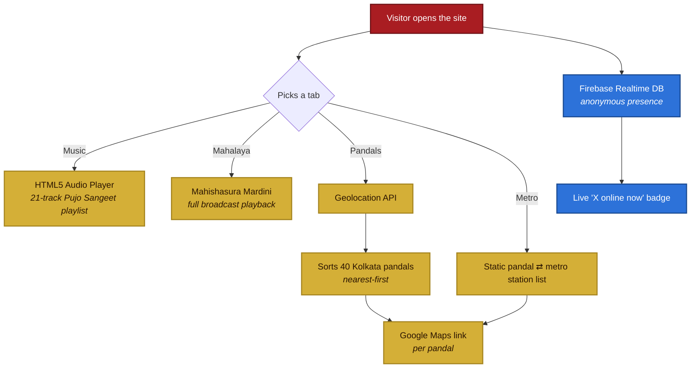

|  | <h2>Sharadiya — শারদীয়া</h2><p align="center"><a href="#features">Features</a> • <a href="#tech-stack">Tech Stack</a> • <a href="#getting-started">Getting Started</a> • <a href="#usage">Usage</a> • <a href="#project-structure">Project Structure</a> • <a href="#contributing">Contributing</a></p> |
|:---:|:---|

[](https://sharadiya.diy)
[](#tech-stack)
[](#tech-stack)


---
`Sharadiya` is a mobile-first, single-page **Durga Pujo companion** — a small static web app (no framework, no backend) made for Bengalis getting into the spirit of the puja. It plays a curated Pujo Sangeet and Mahalaya playlist in the background, helps you find and route to Kolkata pandals near you, points to the nearest Metro station for each one, and counts down the days to Pujo — all inside a glassy crimson-and-gold interface with festive art rotating behind it. It's built to run at the custom domain **sharadiya.diy**.

---

## Preview

<p align="center"></p>

---

## Features

- **Pujo Sangeet Player** — a 21-track playlist of Durga Pujo songs in a glassmorphic mini-player: play/pause, next/prev, a tap-to-seek progress bar, and a slide-up drawer to jump to any track.
- **Mahalaya** — its own tab for one-tap playback of the classic *Mahishasura Mardini* broadcast.
- **Pandal Finder** — asks for your location, then sorts 40 well-known Kolkata pandals nearest-first, each with a one-tap Google Maps link.
- **Metro Companion** — the same pandal list, mapped instead to its nearest Kolkata Metro station.
- **Live Pujo Countdown** — a Bengali banner ("দুর্গাপুজোর আর X দিন বাকি") that switches to a Pujo greeting once the day arrives.
- **Live Visitor Badge** — a real-time "online now" count powered by Firebase presence.
- **A Note** — a short personal message from the creator, one tap away from the home screen.
- **Rotating Festive Backdrops** — full-bleed background art that changes every 10 minutes, with separate image sets for mobile/portrait and desktop/landscape.
- **Feels Native** — safe-area-aware layout, lock-screen media controls via the Media Session API, and a screen wake lock so playback doesn't dim the screen mid-song.

---

## How It Works



---

## Tech Stack

- **Vanilla HTML / CSS / JavaScript** — no framework, no bundler, no build step
- **HTML5 `<audio>`**, with the **Media Session API** for lock-screen / notification controls
- **Screen Wake Lock API** to keep the display on during playback
- **Geolocation API** to sort pandals by distance
- **Firebase Realtime Database + Anonymous Auth** for the live "online now" counter
- **Google Fonts** — Plus Jakarta Sans, Tiro Bangla, Baloo Da 2, Hind Siliguri
- `robots.txt` + `sitemap.xml` for basic SEO; deployed as a static site

---

## Project Structure

```text
Sharadiya/
├── index.html          # Main app — Music, Mahalaya, Pandals & Metro tabs
├── message.html         # "A Note" – a short message from the creator
├── robots.txt            # Search-engine crawl rules
├── sitemap.xml             # SEO sitemap
├── logo.png                 # Site icon / favicon
├── mahalaya.jpg                # Album art for the Mahalaya track
├── pujo.png                      # Backdrop — desktop / landscape view
├── chokhudan.jpg                   # Backdrop (mobile) + social preview image
├── Sakti.png                         # Backdrop — mobile / portrait
├── alo.jpg                             # Backdrop — mobile / portrait
├── dristi.png                            # Backdrop — mobile / portrait
├── poribar.jpg                             # Backdrop — mobile / portrait
├── prem.png                                  # Backdrop — mobile / portrait
├── pujoalo.jpg                                 # Backdrop — mobile / portrait
├── sobarpujo.jpg                                 # Backdrop — mobile / portrait
│
├── mahalaya/
│   └── Mahalaya (Mahishasura Mardini).mp3    # Full Mahalaya broadcast
│
└── pujo_songs/
    └── *.mp3                                 # 21 curated Pujo Sangeet tracks
```

---

## Getting Started

Sharadiya is a static site — there's no build step, no `npm install`, and no server-side code.

1. **Clone the repository**
   ```bash
   git clone https://github.com/Prabrit/Sharadiya.git
   cd Sharadiya
   ```
2. **Serve it locally.** Opening `index.html` directly works for browsing, but a couple of features need a proper `http(s)` origin:
   ```bash
   npx serve .
   # or
   python3 -m http.server 8000
   ```
3. Visit the address your server prints (e.g. `http://localhost:8000`).

> **Note:** The Geolocation API (Pandal Finder) and the Screen Wake Lock API only run over `https://` or `localhost`. Opening `index.html` straight from disk (`file://`) will silently disable "nearest to you" sorting and the wake lock.

---

## Usage

Sharadiya opens on the **Music** tab. Switch views with the pill-shaped tab bar under the title:

| Tab | What it does |
|---|---|
| Music | Full playback controls (play/pause, next/prev, tap-to-seek) for the 21-track Pujo Sangeet playlist, plus a drawer to jump to any track. |
| Mahalaya | One-tap playback of the full *Mahishasura Mardini* broadcast. |
| Pandals | Requests location permission, then lists 40 Kolkata pandals sorted nearest-first, each with a one-tap Google Maps route. |
| Metro | The same pandal list, mapped instead to its nearest Kolkata Metro station. |

A few other touches:
- **A Note** (top-left pill) opens a short personal message from the creator in a new tab.
- The banner under the tab bar counts down the days to Durga Pujo in Bengali, switching to a "শুভ শারদীয়া!" greeting once it arrives.
- The background rotates through festive artwork every 10 minutes.
- Where supported, lock-screen media controls and a wake lock kick in automatically once playback starts.

---

## Configuration

### Live "Online Now" Counter

The badge next to the clock shows how many people currently have the site open, using a Firebase Realtime Database presence pattern with anonymous sign-in. To run your own copy without mixing your visits into the original site's count:

1. Create a project in the [Firebase console](https://console.firebase.google.com/).
2. Enable **Realtime Database**, and turn on **Anonymous** sign-in under Authentication.
3. Restrict the database so a signed-in user can only write their own presence node, for example:
   ```json
   {
     "rules": {
       "status": {
         "$uid": {
           ".read": true,
           ".write": "auth != null && auth.uid == $uid"
         }
       }
     }
   }
   ```
4. In `index.html`, swap the `firebaseConfig` object near the bottom of the file for the one from **Project settings → General → Your apps → Web app** in your own Firebase project.

This piece is optional — if it's left as-is or fails to connect, the rest of the site works normally and the badge simply stops updating.

---

## Notes & Known Limitations

- The Durga Pujo countdown target (currently `October 16, 2026`) is hardcoded in `index.html` and needs a manual update every year.
- The Pandal and Metro lists are a static, hand-maintained array in `index.html` — corrections or additions mean editing the file directly.
- Geolocation is used only in the browser, purely to sort the pandal list by distance; nothing is sent to or stored on a server.
- A small script blocks right-click and common dev-tools shortcuts. It's a light deterrent, not real protection, and doesn't affect normal browsing.

---

## Contributing

Sharadiya is a personal project, but fixes, new pandal listings, and song suggestions are welcome.

1. Fork the repository.
2. Create a feature branch (`git checkout -b feature/AmazingFeature`).
3. Commit your changes (`git commit -m 'Add some AmazingFeature'`).
4. Push to your fork (`git push origin feature/AmazingFeature`).
5. Open a Pull Request.

Spotted a bug, or a pandal/metro pairing that's wrong or missing? You can also reach out directly through the **"A Note"** page on the site.

---


## Acknowledgments

- The Pujo Sangeet and Mahalaya recordings featured here are the work of their original artists and broadcasters — Sharadiya curates and plays them, it doesn't claim to have created them.
- Fonts via [Google Fonts](https://fonts.google.com/): Plus Jakarta Sans, Tiro Bangla, Baloo Da 2, and Hind Siliguri.
- Presence / the "online now" counter is powered by [Firebase](https://firebase.google.com/).

---

<p align="center">
  Made with ❤️ for Bengalis everywhere — শুভ শারদীয়া 🙏
</p>
